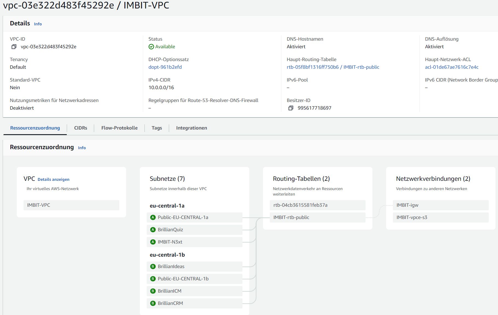

import Tabs from '@theme/Tabs';
import TabItem from '@theme/TabItem';

## Domains and DNS Configuration

Below is a quick reference table for all our domains, which are registered and managed by AWS Route 53 or Cloudflare.  

:::info
We are currently in the process of switching DNS (and maybe domain registration) over to Cloudflare.  
This provides improvements in costs and ease of use.
:::

### Domain List

| Applications     | Domain                                                           | DNS        |Registration |
|------------------|------------------------------------------------------------------|------------|-------------|
| BrillianIDEAS, BrillianDOCS, Wordpress Page, AWS SES  | [brillianideas.com](https://brillianideas.com) | Cloudflare | AWS         |
| BrillianQUIZ     | [brillianquiz.com](https://brillianquiz.com)                     | AWS        | AWS         |
| BrillianCRM      | [brilliancrm.com](https://brilliancrm.com)                       | AWS        | AWS         |
| BrillianICM      | [brillianicm.com](https://brillianicm.com)                       | AWS        | AWS         |
| IMBIT-N3XT       | [imbit-n3xt.com](https://imbit-n3xt.com)                         | AWS        | AWS         |
| Unused           | [digital-learning-imbit.com](https://digital-learning-imbit.com) | Cloudflare | AWS         |

### DNS Settings by Domain

<Tabs
  defaultValue="brillianideas"
  values={[
    { label: 'BrillianIDEAS', value: 'brillianideas' },
    { label: 'BrillianQUIZ', value: 'brillianquiz' },
    { label: 'BrillianCRM', value: 'brilliancrm' },
    { label: 'BrillianICM', value: 'brillianicm' },
    { label: 'IMBIT-N3XT', value: 'imbit-n3xt' },
  ]}>

<TabItem value="brillianideas">
| Name                                                             | Type  | Value                                               | Notes                      |
|------------------------------------------------------------------|-------|-----------------------------------------------------|----------------------------|
| brillianideas.com                                                | A     | 185.199.111.153                                     | GitHub Pages site          |
| brillianideas.com                                                | A     | 185.199.110.153                                     | GitHub Pages site          |
| brillianideas.com                                                | A     | 185.199.109.153                                     | GitHub Pages site          |
| brillianideas.com                                                | A     | 185.199.108.153                                     | GitHub Pages site          |
| imbit.brillianideas.com                                          | A     | 3.66.131.100                                        | Wordpress page             |
| brillianideas.com                                                | AAAA  | 2606:50c0:8003::153                                 | GitHub Pages site          |
| brillianideas.com                                                | AAAA  | 2606:50c0:8002::153                                 | GitHub Pages site          |
| brillianideas.com                                                | AAAA  | 2606:50c0:8001::153                                 | GitHub Pages site          |
| brillianideas.com                                                | AAAA  | 2606:50c0:8000::153                                 | GitHub Pages site          |
| docs.brillianideas.com                                           | CNAME | imbit-mannheim.github.io                            | GitHub Pages site          |
| www.brillianideas.com                                            | CNAME | imbit-mannheim.github.io                            | GitHub Pages site          |
| _github-pages-challenge-imbit-mannheim.brillianideas.com         | TXT   | "d4b01c7a5921fe5112bbba33a81e36"                    | GitHub Pages DNS challenge |
| _github-pages-challenge-imbit-mannheim.docs.brillianideas.com    | TXT   | "cdbb5a3754bb98d49fb2233f3829ab"                    | GitHub Pages DNS challenge |

</TabItem>

<TabItem value="brillianquiz">

| Name                                         | Type  | Alias | Value                                                     | Notes                                        |
|----------------------------------------------|-------|-------|-----------------------------------------------------------|----------------------------------------------|
| brillianquiz.com                             | A     | Yes   | d44wz0zejg2wr.cloudfront.net.                             | Maps domain to the IP of the CloudFront distribution |
| www.brillianquiz.com                         | CNAME | No    | brillianquiz.com                                          | Redirects www requests to root domain        |
| _77d87ffe10ab0bceff29020980b9cd3c.brillianquiz.com | CNAME | No    | _c67e2fcd4fe8162ef24090e351fa4940.qwknvqrlct.acm-validations.aws. | Domain verification record for AWS Certificate Manager |
| _f01b5d82b5df263850b71bf36daec563.www.brillianquiz.com | CNAME | No    | _7139c66877b222aefb2c5631b13642ec.sdgjtdhdhz.acm-validations.aws. | Domain verification record for AWS Certificate |
| brillianquiz.com                             | NS    | No    | ns-774.awsdns-32.net.                                     | Name server record |
| brillianquiz.com                             | NS    | No    | ns-1276.awsdns-31.org.                                    | Name server record |
|                                              |       |       | ns-310.awsdns-38.com.                                     | Name server record |
|                                              |       |       | ns-1807.awsdns-33.co.uk.                                  | Name server record |
| brillianquiz.com                             | SOA   |       | ns-774.awsdns-32.net. awsdns-hostmaster.amazon.com. 1 7200 900 1209600 86400 | Start of authority record |

</TabItem>

<TabItem value="brilliancrm">

| Name                                         | Type  | Alias | Value                                                     | Notes                                        |
|----------------------------------------------|-------|-------|-----------------------------------------------------------|----------------------------------------------|
| brilliancrm.com                              | A     | Yes   | d3afk01lmot4so.cloudfront.net.                            | Maps domain to the IP of the CloudFront distribution |
| www.brilliancrm.com                          | CNAME | No    | brilliancrm.com                                           | Redirects www requests to root domain        |
| _640b6e499834dd4af82f6c4a80ff66c2.brilliancrm.com | CNAME | No    | _df8fcdda00dc379959813dc61da98cef.tljzshvwok.acm-validations.aws. | Domain verification record for AWS Certificate Manager |
| _ed128d356aebb2cab6a55f86915d08ce.www.brilliancrm.com | CNAME | No    | _aaf65bf87b9fcb7889cd105ffeebd1b9.tljzshvwok.acm-validations.aws. | Domain verification record for AWS Certificate |
| brilliancrm.com                              | NS    | No    | ns-1233.awsdns-26.org.                                     | Name server record |
|                                              |       |       | ns-492.awsdns-61.com.                                      | Name server record |
|                                              |       |       | ns-1944.awsdns-51.co.uk.                                   | Name server record |
|                                              |       |       | ns-772.awsdns-32.net.                                      | Name server record |
| brilliancrm.com                              | SOA   | No    | ns-1233.awsdns-26.org. awsdns-hostmaster.amazon.com. 1 7200 900 1209600 86400 | Start of authority record |

</TabItem>

<TabItem value="brillianicm">

| Name                                       | Type  | Alias | Value                                                   | Notes                                        |
|--------------------------------------------|-------|-------|---------------------------------------------------------|----------------------------------------------|
| brillianicm.com                            | A     | Yes     | d3u7jacjxiarm3.cloudfront.net.                        | Maps the domain to the IP address of the cloudfront distribution |
| www.brillianicm.com                        | CNAME | No     | brillianicm.com                                        | Redirects www requests to root domain |
| _368e6af4ff5a4e74b63f30ab88b480ad.brillianicm.com | CNAME | No | _b54fd6b407b89c145d223cdd9f0d7312.tljzshvwok.acm-validations.aws. | Domain verification record for AWS Certificate Manager  |
| _824f68c0c2aac3394f10411743621e10.www.brillianicm.com | CNAME | No | _088ebed53ee5188f26a46b410af27374.tljzshvwok.acm-validations.aws. | Domain verification record for AWS Certificate |
| brillianicm.com                            | NS       | No    | ns-872.awsdns-45.net.                                  | Name server record                           |
|                                            |          |       | ns-354.awsdns-44.com.                                   |                                              |
|                                            |          |       | ns-1473.awsdns-56.org.                                  |                                              |
|                                            |          |       | ns-1636.awsdns-12.co.uk.                                |                                              |
| brillianicm.com                            | SOA      | No    | ns-872.awsdns-45.net. awsdns-hostmaster.amazon.com. 1 7200 900 1209600 86400 | Start of authority record |
</TabItem>

<TabItem value="imbit-n3xt">

| Name                                         | Type  | Alias | Value                                                     | Notes                                        |
|----------------------------------------------|-------|-------|-----------------------------------------------------------|----------------------------------------------|
| imbit-n3xt.com (SET UP IN LIGHTSAIL!)        | A     | Yes   | dd30hbilqged6x5.cloudfront.net.                           | Maps the domain to the IP address of the cloudfront distribution |
| dev.pixels.imbit-n3xt.com                    | A     | No    | REDACTED                                                  | Developement envireonment for IMBIT Pixels on private infrastructure |
| www.imbit-n3xt.com                           | CNAME | No    | imbit-n3xt.com                                            | Redirects www requests to root domain |
| _bcc914229131bb82db3a34834975ae7a.imbit-n3xt.com | CNAME | No    | _a5395a1c1af42243d9e03f0d2f9c8667.sdgjtdhdhz.acm-validations.aws. | Domain verification record for AWS Certificate Manager |
| _7647f79bc805dcc886644a75c52c06ee.www.imbit-n3xt.com | CNAME | No    | _9477ed1f24af672e783b6639ba206d09.sdgjtdhdhz.acm-validations.aws. | Domain verification record for AWS Certificate |
| pixels.imbit-n3xt.com                        | CNAME | No    | imbit-mannheim.github.io                                  | Pixels Minigame hosted on Github Pages |
| imbit-n3xt.com                               | NS    | No    | ns-1847.awsdns-38.co.uk.                                  | Name server record |
|                                              | NS    | No    | ns-1446.awsdns-52.org.                                    |                    |
|                                              | NS    | No    | ns-488.awsdns-61.com.                                     |                    |
|                                              | NS    | No    | ns-974.awsdns-57.net.                                     |                    |
| imbit-n3xt.com                               | SOA   | No    | ns-1847.awsdns-38.co.uk. awsdns-hostmaster.amazon.com. 1 7200 900 1209600 86400 | Start of authority record |
| _gh-imbit-mannheim-o.imbit-n3xt.com          | TXT   | No    | "0ee8238c20"                                              | Domain verification record for Github Pages |

</TabItem>

</Tabs>

## Networking Setup

The AWS networking is handled in the VPC Dashboard. A new VPC, called `IMBIT-VPC`, was created with a /24 subnet for each application.

### Subnets Overview

| Name                | Subnet ID                 | IPv4 CIDR       | Availability Zone |
|---------------------|---------------------------|-----------------|-------------------|
| Public-EU-CENTRAL-1a| subnet-01a8c817059d12a4d  | 10.0.0.0/20     | eu-central-1a     |
| Public-EU-CENTRAL-1b| subnet-0717fdb65b0a31b38  | 10.0.16.0/20    | eu-central-1b     |
| BrillianCRM         | subnet-0439f43bf8fb29801  | 10.0.41.0/24    | eu-central-1b     |
| BrillianICM         | subnet-050a30c1bfc623361  | 10.0.42.0/24    | eu-central-1b     |
| BrillianIDEAS       | subnet-0802987cab48623ee  | 10.0.43.0/24    | eu-central-1b     |
| BrillianQUIZ        | subnet-0fdb84aa269bb45b7  | 10.0.44.0/24    | eu-central-1a     |
| IMBIT-N3XT          | subnet-01dbe3669b188c9de  | 10.0.45.0/24    | eu-central-1a     |

### Visual Overview

